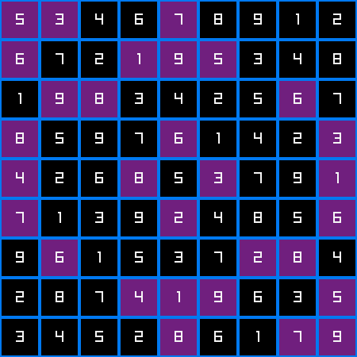

# recursive-sudoku-viz
Recursive sudoku solver visualizer in raylib

## Usages
It depends on [raylib](https://www.raylib.com/) library. Before running this you need to be raylib installed on your system.
```sh
$ make
$ ./solver
```

## Screenshot

